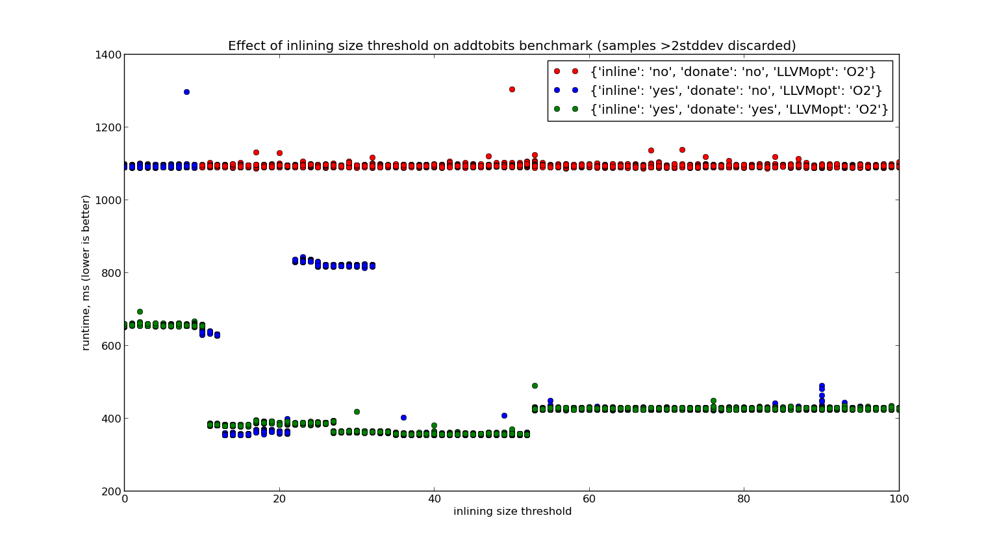

Inlining
========

Consider this source program::

    main = {
      aaaaaaaaa "1"
    };

    aaaaaaaaa = { t:Text =>
      bbbbbbbbb t
    };

    bbbbbbbbb = { t:Text =>
      REC ccccc = { x =>
          case t
            of $TextFragment a n     -> ()
            of $TextConcat   s1 s2 n ->
                bbbbbbbbb s2 ; ccccc s1
          end
      };
      ccccc t;
    };

Which is presented to the inliner as::

    letfuns
      bbbbbbbbb = { t!3 =>
          letfuns
            ccccc!5 = { x!6 =>
                case t!3
                  of ($TextFragment a!8 n!9) -> ()
                  of ($TextConcat s1!10 s2!11 n!12) -> let .seq!13  = bbbbbbbbb s2!11 /* (non-tail) */ in
                  ccccc!5 s1!10 /* (tail) */
                end
            } bbbbbbbbb___ccccc___<anon_fn_ (rec?: True )
          in
          ccccc!5 t!3 /* (tail) */
          end
      } bbbbbbbbb (rec?: True )
    in
    letfuns
      aaaaaaaaa = { t!19 =>
          bbbbbbbbb t!19 /* (tail) */
      } aaaaaaaaa (rec?: False )
    in
    letfuns
      main = {
          let .x!27    = "1" in
          aaaaaaaaa .x!27 /* (tail) */
      } main (rec?: False )
    in
    main !
    end

This code is inlined to::

    letfuns
      bbbbbbbbb = { t!74 =>
          letfuns
            ccccc!75 = { x!102 =>
                case t!74
                  of ($TextFragment a!103 n!104) -> ()
                  of ($TextConcat s1!105 s2!106 n!107) ->
                       let .seq!108 = letfuns
                          ccccc!135 = { x!142 =>
                              case s2!106
                                of ($TextFragment a!143 n!144) -> ()
                                of ($TextConcat s1!145 s2!146 n!147) -> let .seq!148 = bbbbbbbbb s2!146 /* (non-tail) */ in
                                case s2!106
                                  of ($TextFragment a!149 n!150) -> ()
                                  of ($TextConcat s1!151 s2!152 n!153) -> let .seq!154 = bbbbbbbbb s2!152 /* (non-tail) */ in
                                  ccccc!135 s1!151 /* (tail) */
                                end
                              end
                          } ccccc135 (rec?: True )
                        in
                        case s2!106
                          of ($TextFragment a!136 n!137) -> ()
                          of ($TextConcat s1!138 s2!139 n!140) -> let .seq!141 = bbbbbbbbb s2!139 /* (non-tail) */ in
                          ccccc!135 s1!138 /* (non-tail) */
                        end
                        end in
                  case t!74
                    of ($TextFragment a!109 n!110) -> ()
                    of ($TextConcat s1!111 s2!112 n!113) ->
                        let .seq!114 = letfuns
                          ccccc!115 = { x!122 =>
                              case s2!112
                                of ($TextFragment a!123 n!124) -> ()
                                of ($TextConcat s1!125 s2!126 n!127) -> let .seq!128 = bbbbbbbbb s2!126 /* (non-tail) */ in
                                case s2!112
                                  of ($TextFragment a!129 n!130) -> ()
                                  of ($TextConcat s1!131 s2!132 n!133) -> let .seq!134 = bbbbbbbbb s2!132 /* (non-tail) */ in
                                  ccccc!115 s1!131 /* (tail) */
                                end
                              end
                          } ccccc115 (rec?: True )
                        in
                        case s2!112
                          of ($TextFragment a!116 n!117) -> ()
                          of ($TextConcat s1!118 s2!119 n!120) -> let .seq!121 = bbbbbbbbb s2!119 /* (non-tail) */ in
                          ccccc!115 s1!118 /* (non-tail) */
                        end
                        end in
                    ccccc!75 s1!111 /* (tail) */
                  end
                end
            } ccccc75 (rec?: True )
          in
          case t!74
            of ($TextFragment a!76 n!77) -> ()
            of ($TextConcat s1!78 s2!79 n!80) ->
                 let .seq!81  = letfuns
                   ccccc!82 = { x!89 =>
                       case s2!79
                         of ($TextFragment a!90 n!91) -> ()
                         of ($TextConcat s1!92 s2!93 n!94) -> let .seq!95  = bbbbbbbbb s2!93 /* (non-tail) */ in
                         case s2!79
                           of ($TextFragment a!96 n!97) -> ()
                           of ($TextConcat s1!98 s2!99 n!100) -> let .seq!101 = bbbbbbbbb s2!99 /* (non-tail) */ in
                           ccccc!82 s1!98 /* (tail) */
                         end
                       end
                   } ccccc82 (rec?: True )
                 in
                 case s2!79
                   of ($TextFragment a!83 n!84) -> ()
                   of ($TextConcat s1!85 s2!86 n!87) -> let .seq!88  = bbbbbbbbb s2!86 /* (non-tail) */ in
                   ccccc!82 s1!85 /* (non-tail) */
                 end
                 end in
            ccccc!75 s1!78 /* (tail) */
          end
          end
      } bbbbbbbbb (rec?: True )
    in
    letfuns
      main = {
          let .x!32    = "1" in
          letfuns
            ccccc!33 = { x!40 =>
                case .x!32
                  of ($TextFragment a!41 n!42) -> ()
                  of ($TextConcat s1!43 s2!44 n!45) -> let .seq!46  = bbbbbbbbb s2!44 /* (non-tail) */ in
                  case .x!32
                    of ($TextFragment a!47 n!48) -> ()
                    of ($TextConcat s1!49 s2!50 n!51) -> let .seq!52  = bbbbbbbbb s2!50 /* (non-tail) */ in
                    ccccc!33 s1!49 /* (tail) */
                  end
                end
            } ccccc33 (rec?: True )
          in
          case .x!32
            of ($TextFragment a!34 n!35) -> ()
            of ($TextConcat s1!36 s2!37 n!38) -> let .seq!39  = bbbbbbbbb s2!37 /* (non-tail) */ in
            ccccc!33 s1!36 /* (tail) */
          end
          end
      } main (rec?: False )
    in
    main !
    end

The ``ccccc`` functions are all contifiable, and thus will not result in
allocation. ``main`` will have three calls to ``bbbbbbbbb``. In this case,
it's not so bad, per se, but this illustrates the dangerous side of inlining --
in general, loop unpeeling can increase the number of allocations made.
For example, with this slightly different source::

    bbbbbbbbb = { t:Text =>
      noinline_f = { 0 };
      REC ccccc = { x =>
          case t
            of $TextFragment a n     -> noinline_f !; ()
            of $TextConcat   s1 s2 n ->
                bbbbbbbbb s2 ; noinline_f !; ccccc s1
          end
      };
      ccccc t;
    };

Suppose, for the sake of argument, that ``f`` is not inlined,
for whatever reason (here we force that decision with the ``noinline_`` prefix).
Because ``f`` has multiple calls with different continuations, it cannot be
contified either. Thus, each inlining of ``b`` will result in additional
allocations. If the recursive call to ``b`` within the ``c`` loop is inlined,
the result can be a degradation in the asymptotic allocation behavior of the
program! Specifically, the (inlined) program above allocates a closure for
``f`` at each left child of the right-most spine of the binary tree.

TODO test to see whether/how often inlining increases allocation in practice?

Inlining Size Threshold
-----------------------

The ``addtobits`` benchmark
~~~~~~~~~~~~~~~~~~~~~~~~~~~

This scatterplot shows several things of interest:

 * When inlining is enabled but the size threshold is too small,
   we don't get any benefit from doing inlining ourselves, beyond
   just letting LLVM handle it. It's not clear whether no inlining
   is happening, or if only trivial functions that LLVM can inline
   are getting inlined.
 * Without donation, the effective performance is sensitive to
   the inlining threshold, in a nonlinear way: the blue points
   jump around from (roughly) 1100, to 650, to 380, to 820,
   back to 380, then eventually 440.
 * With donation, we get much more consistent benefit: with
   a tiny threshold, runtime is nearly halved, and there is
   no "bad spot" between 20 and 30.
 * Curiosity 1: it seems that donation is a slight loss between
   13 and 20. Is it a real effect or a benchmarking artifact?
 * Curiosity 2: a size threshold of 40 appears to do better
   than a size threshold of 20.  Is it a real difference?

To answer these curiosities, we can use the ``ministat`` and
``compare-perf`` tools, which we can use to re-run the generated
binaries to give better statistical insights.

For (1)::

    |   +**********xx                                                                                                     |
    |   +**********xxx                                                                                                    |
    |   +**********xxx                                                                                                    |
    |   +**********xxx                                                                                                    |
    |   +**********xxx                                                                                                    |
    |   +**********xxx                                                                                                    |
    |   +**********xxx                                                                                                    |
    |   +**********xxx                                                                                                    |
    |   +**********xxx                                                                                                    |
    |   +**********xxx                                                                                                    |
    |   +***********xx                                                                                                    |
    |   +***********xx                                                                                                    |
    |   +***********xx                                                                                                    |
    |   +***********xx                                                                                                    |
    |   ************xx                                                                                                    |
    |   ************xx                                                                                                    |
    |   *************x                                                                                                    |
    |  +*************x                                                                                                    |
    |  +*************x                                                                                                    |
    |  +*************x                                                                                                    |
    |  +*************x                                                                                                    |
    | +**************x                                                                                                    |
    | ****************  *                                                                                                 |
    |+****************xx*  *  + x              +                                                                          |
    |+*****************x*  *x * x     x+ + +   +       * **xx + +         x     *     +      * x  x  +  +x        xx    xx|
    |   |____AA__|__|                                                                                                     |
    +---------------------------------------------------------------------------------------------------------------------+
        N           Min           Max        Median           Avg        Stddev
    x 3334         0.787         0.999         0.802    0.80270906   0.010554387
    + 3349         0.786         0.968           0.8    0.80035443  0.0079365067
    Difference at 95.0% confidence
      -0.00235462 +/- 0.000447614
      -0.293335% +/- 0.0557629%
      (Student's t, pooled s = 0.00933473)

A small handful of obvious outliers -- runtimes above 1.0 -- were manually discarded.
Interestingly, the outliers formed a (very small) bimodal distribution, not the long tail
observed here.

I believe the t-test results here are misleading, because the actual distributions of runtimes
is most definitely **not** a normal distribution, it's more like an Erlang distribution.
Thus the remaining outliers exert undue influence on the result. Keep in mind that the
original difference appeared to be on the order of at least 5%, so a claimed 0.3% difference
is cause for rejecting the initial appearance of a performance discrepancy.

For (2)::

    x before
    + after_
    +---------------------------------------------------------------------------------------------------------------------+
    |        +    +                                                                                                       |
    |        +  + +                                                                                                       |
    |        +  + +                                                                                                       |
    |        +  + +                                                                                                       |
    |        +  + +                                                                                                       |
    |        +  + +                                                                                                       |
    |        +  + +                                                                                                       |
    |        +  + +    +                                                                                                  |
    |        +  + +  + +                                          x                                                       |
    |        +  + +  + +                                          x            x x                                        |
    |        +  + +  + +                                          x    x       x x                                        |
    |     +  +  + +  + +                                          x    x       x x  x                                     |
    |     +  +  + +  + +                                          x    x  x    x x  x                                     |
    |     +  +  + +  + +                                    x  x  x    x  x x  x x  x  x                                  |
    |     +  +  + +  + +  +                                 x  x  x    x  x x  x x  x  x x                                |
    |     +  +  + +  + +  +                            x    x  x  x    x  x x  x x  x  x x                                |
    |     +  +  + +  + +  +  +                         x    x  x  x    x  x x  x x  x  x x  x                             |
    |   + +  +  + +  + +  +  +                         x    x  x  x x  x  x x  x x  x  x x  x                             |
    |+  + +  +  + +  + +  +  +         +          x    x    x  x  x x  x  x x  x x  x  x x  x  x x     x    x    x  x    x|
    |       |_____A____|                                        |___________MA____________|                               |
    +---------------------------------------------------------------------------------------------------------------------+
        N           Min           Max        Median           Avg        Stddev
    x 101         0.794         0.821         0.804    0.80420792  0.0049725584
    +  99         0.777          0.79         0.782    0.78176768  0.0021035843
    Difference at 95.0% confidence
      -0.0224402 +/- 0.00106201
      -2.79035% +/- 0.132057%
      (Student's t, pooled s = 0.00383122)

Ok, this looks perhaps more significant -- let's run more tests and check::

    |     ++++  xxxxx                                                                                                     |
    |     ++++  xxxxx                                                                                                     |
    |     ++++  xxxxx                                                                                                     |
    |     ++++  xxxxx                                                                                                     |
    |     ++++ xxxxxxx                                                                                                    |
    |     ++++ xxxxxxx                                                                                                    |
    |     ++++ xxxxxxx                                                                                                    |
    |     +++++xxxxxxx                                                                                                    |
    |     +++++xxxxxxx                                                                                                    |
    |     +++++xxxxxxx                                                                                                    |
    |     +++++xxxxxxx                                                                                                    |
    |     +++++xxxxxxx                                                                                                    |
    |     +++++xxxxxxxx                                                                                                   |
    |     +++++xxxxxxxx                                                                                                   |
    |     +++++xxxxxxxx                                                                                                   |
    |     +++++xxxxxxxx                                                                                                   |
    |     +++++xxxxxxxx                                                                                                   |
    |     ++++*xxxxxxxx                                                                                                   |
    |     ++++*xxxxxxxx                                                                                                   |
    |     ++++**xxxxxxx                                                                                                   |
    |     ++++**xxxxxxx                                                                                                   |
    |     ++++**xxxxxxx                                                                                                   |
    |     ++++**xxxxxxxx                                                                                                  |
    |     ++++***x*xxxxx  +                                                                                               |
    |    +++++***x*x*xx* x+x*   +          x                                            x   x            +      +        x|
    ||_____|MA____MA|______|                                                                                              |
    +---------------------------------------------------------------------------------------------------------------------+
        N           Min           Max        Median           Avg        Stddev
    x 337         0.355         0.575         0.364    0.36581899   0.016815699
    + 337         0.345         0.556         0.351    0.35262018    0.01588532
    Difference at 95.0% confidence
      -0.0131988 +/- 0.00246981
      -3.60802% +/- 0.675145%
      (Student's t, pooled s = 0.0163571)

Hmm, those outliers. Let's remove 'em::

    |          + +  + +                          x  x x  x                                                                |
    |          + +  + +                          x  x x  x                                                                |
    |          + +  + +                        x x  x x  x                                                                |
    |       +  + +  + +                        x x  x x  x                                                                |
    |       +  + +  + +                        x x  x x  x                                                                |
    |       +  + +  + +                        x x  x x  x x                                                              |
    |       +  + +  + +                        x x  x x  x x                                                              |
    |       +  + +  + +                        x x  x x  x x                                                              |
    |       +  + +  + +                   x    x x  x x  x x                                                              |
    |       +  + +  + +                   x    x x  x x  x x  x                                                           |
    |       +  + +  + +                   x    x x  x x  x x  x                                                           |
    |       +  + +  + +                   x    x x  x x  x x  x                                                           |
    |       +  + +  + +              x    x x  x x  x x  x x  x                                                           |
    |       +  + +  + +  +           x    x x  x x  x x  x x  x                                                           |
    |       +  + +  + +  +           x    x x  x x  x x  x x  x                                                           |
    |       +  + +  + +  +           x    x x  x x  x x  x x  x                                                           |
    |       +  + +  + +  +           x    x x  x x  x x  x x  x x                                                         |
    |       +  + +  + +  +           x    x x  x x  x x  x x  x x                                                         |
    |       +  + +  + +  + +         x  x x x  x x  x x  x x  x x                                                         |
    |       +  + +  + +  + +         x  x x x  x x  x x  x x  x x                                                         |
    |       +  + +  + +  + +  + +    x  x x x  x x  x x  x x  x x                                                         |
    |       +  + +  + +  + +  + +    x  x x x  x x  x x  x x  x x  x x                                                    |
    |       +  + +  + +  + +  + +    x  x x x  x x  x x  x x  x x  x x                                                    |
    |       +  + +  + +  + +  + +    x  x x x  x x  x x  x x  x x  x x                                                    |
    |     + +  + +  + +  + +  + *    x  x x x  x x  x x  x x  x x  x x  x                                                 |
    |     + +  + +  + +  + +  + *  x x  x x x  x x  x x  x x  x x  x x  x                                                 |
    |     + +  + +  + +  + +  * *  * *  x x x  x x  x x  x x  x x  x x  x x                                               |
    |     + +  + +  + +  + +  * *  * *  x x x  x x  x x  x x  x x  x x  x x                                               |
    |+    + +  + +  + +  + +  * *  * *  * * x  x *  * x  x x  * x  x x  x x  +      x    + +  x      +  x                +|
    |     |_________MA__________|         |_________A_________|                                                           |
    +---------------------------------------------------------------------------------------------------------------------+
        N           Min           Max        Median           Avg        Stddev
    x 333         0.355         0.385         0.364    0.36416817  0.0040481226
    + 335         0.345         0.392         0.351    0.35144776   0.004610206
    Difference at 95.0% confidence
      -0.0127204 +/- 0.000658114
      -3.493% +/- 0.180717%
      (Student's t, pooled s = 0.00433912)

So: it looks like there is, in fact, a performance gain when raising the inlining threshold.
Incidentally, this demonstrates the value of tools like ``ministat`` to clearly show
statistically significant performance differences on the order of milliseconds.

