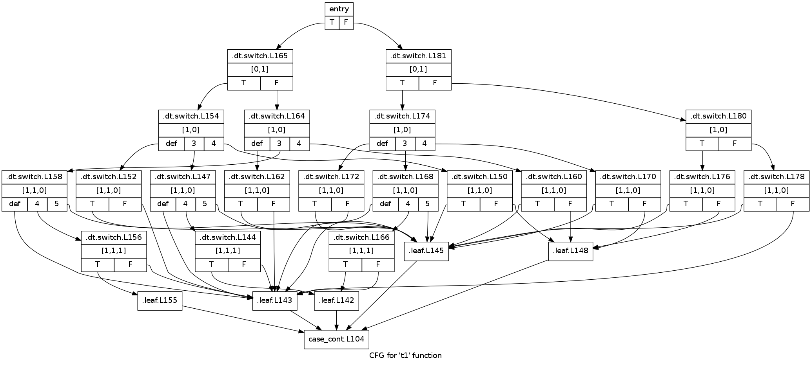
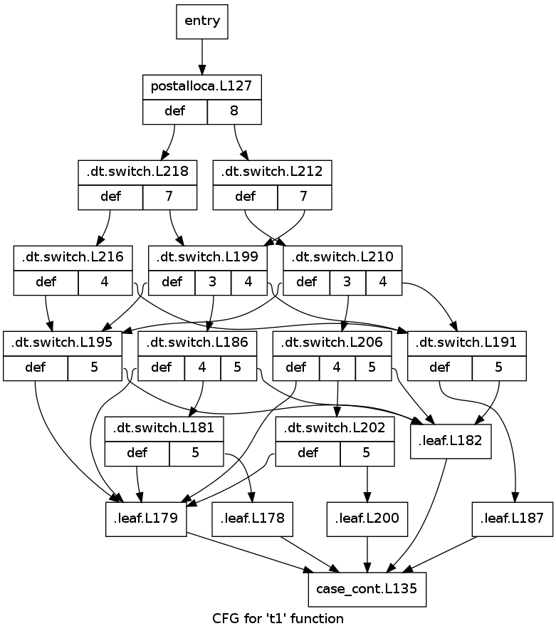

Pattern Match Compilation
-------------------------

Compilation of nested pattern matches to flat decision trees has bounced
back and forth between happening "early" (just after typechecking) or "late"
(just before codegen) in the middle end.

Currently, match compilation happens "late", during closure conversion,
as a transformation on control flow graphs.

In the future, I'd like to revisit moving match compilation earlier
in the pipeline. Pattern match compilation can (and, I think, should)
be expressed as a source-to-source program transformation.  Thanks to
guaranteeed contification, the apparent overhead added by a source-level
transformation can be reliably eliminated.

A Medium Example
~~~~~~~~~~~~~~~~

We'll start with a medium-sized example to illustrate how a
not-completely-trivial example is handled.

For this source function::

    t4 = {
      expect_i32 6;
      print_i32
        case (1, (2, 3))

          of (10, (30, x)) -> x +Int32 11
          of (10, (40, x)) -> x +Int32 22
          of (20, (x, 30)) -> x +Int32 33
          of (20, (_,  x)) -> x +Int32 44
          of (a,  qq     ) -> 66

        end;
    };

we'd build a CFG like this::

    t4 = {
            ret k = (rk,L58)
            entry = (postalloca,L57)
            ------------------------------

        postalloca.L57 []
            let .x!5 = 6
            let .seq!2 = prim expect_i32 .x!5
            let .x!8 = 1
            let .x!6 = 2
            let .x!7 = 3
            let .x!9 = (.x!6, .x!7)
            let .x!14 = (.x!8, .x!9)
        case .x!14
          of (10, (30, x!4))      -> case_arm.L59
          of (10, (40, x!5))      -> case_arm.L60
          of (20, (x!6, 30))      -> case_arm.L61
          of (20, (_, x!7))       -> case_arm.L62
          of (a!8, qq!9)          -> case_arm.L63

        case_arm.L63 []
            let .cfg_seq!69 = 66
        cont case_cont.L64 [.cfg_seq!69]

        case_arm.L62 []
            let .x!13 = 44
            let .cfg_seq!68 = prim + x!7 .x!13
        cont case_cont.L64 [.cfg_seq!68]

        case_arm.L61 []
            let .x!12 = 33
            let .cfg_seq!67 = prim + x!6 .x!12
        cont case_cont.L64 [.cfg_seq!67]

        case_arm.L60 []
            let .x!11 = 22
            let .cfg_seq!66 = prim + x!5 .x!11
        cont case_cont.L64 [.cfg_seq!66]

        case_arm.L59 []
            let .x!10 = 11
            let .cfg_seq!65 = prim + x!4 .x!10
        cont case_cont.L64 [.cfg_seq!65]

        case_cont.L64 [.x!15]
            let .cfg_seq!70 = prim print_i32 .x!15
        cont rk.L58 [.cfg_seq!70]
    }

We've changed the RHSes from expressions to simple labels, but
the patterns on the LHS remain nested.

Later, during closure conversion, we'll perform pattern match compilation,
which will build a decision tree and render it out to flattened patterns::

    t4 []
    {
            ret k = (rk,L58)
            entry = (postalloca,L57)
            ------------------------------
        postalloca.L57 []
            let .x!5 = 6
            let .seq!2 = prim expect_i32 .x!5
            let .x!8 = 1
            let .x!6 = 2
            let .x!7 = 3
            let .x!9 = (.x!6, .x!7)
            let .x!14 = (.x!8, .x!9)
        case .x!14/[0]
          of Int32.<Int32>(10) -> .dt.switch.L129
          of Int32.<Int32>(20) -> .dt.switch.L133
          default:             -> .leaf.L127

        .dt.switch.L133 []
        case .x!14/[1,1]
          of Int32.<Int32>(30) -> .leaf.L130
          default:             -> .leaf.L131

                .leaf.L131 []
                    let x!7 = .x!14/[1,1]
                    let .x!13 = 44
                    let .cfg_seq!68 = prim + x!7 .x!13
                cont case_cont.L64 [.cfg_seq!68]

                .leaf.L130 []
                    let x!6 = .x!14/[1,0]
                    let .x!12 = 33
                    let .cfg_seq!67 = prim + x!6 .x!12
                cont case_cont.L64 [.cfg_seq!67]

        .dt.switch.L129 []
        case .x!14/[1,0]
          of Int32.<Int32>(30) -> .leaf.L125
          of Int32.<Int32>(40) -> .leaf.L126
          default:             -> .leaf.L127

                .leaf.L126 []
                    let x!5 = .x!14/[1,1]
                    let .x!11 = 22
                    let .cfg_seq!66 = prim + x!5 .x!11
                cont case_cont.L64 [.cfg_seq!66]

                .leaf.L125 []
                    let x!4 = .x!14/[1,1]
                    let .x!10 = 11
                    let .cfg_seq!65 = prim + x!4 .x!10
                cont case_cont.L64 [.cfg_seq!65]

        .leaf.L127 []
            let a!8 = .x!14/[0]
            let qq!9 = .x!14/[1]
            let .cfg_seq!69 = 66
        cont case_cont.L64 [.cfg_seq!69]

        case_cont.L64 [.x!15]
            let .cfg_seq!70 = prim print_i32 .x!15
        cont rk.L58 [.cfg_seq!70]
    }

I've manually indented some of the basic blocks to reflect
the logical nesting of the flattened conditionals. Rather than having
a list of patterns, we've reduced the LHSes to a list of constructors.

Occurrences
"""""""""""

To denote sub-terms from nested patterns, we use *occurrences*,
which describe paths of pointer indirections and offsets.

For example, the occurrence for the original term is ``.x!14[]``.
The value from the second slot of the tuple, bound as ``qq`` in one branch,
is ``.x!14[1]``. Similarly, the variables ``x!4``, ``x!5``, and ``x!7``
are all aliases for the occurrence ``.x!14[1,1]``.

Note that the path to any given leaf may or may
not test the occurrences that are bound in the leaf.
For example, on the way to ``.leaf.L131``, the ``[1,1]`` subterm is tested,
but on the way to ``L126``, ``[1,1]`` is not tested. In general, there is no
relationship between the occurrences tested on the way to a leaf and
the occurrences used by the leaf.

As written, the semantics of occurrences are simple: for an occurrence
path of length n, start at the base variable and follow n pointer indirections
via the appropriate struct offsets. However, in many cases, this will duplicate
some or all of the work that has already been done. In particular, in ``L.131``,
the value we tested to read the leaf is the same value being bound to ``x!7``,
so we might as well reuse that value instead of following all those pointer
indirections again. The general case can be solved with an available-variables
computation. That way, if (say) a binding ``y = x[1]`` is available,
``z = x[1,0]`` can be optimized to ``z = y[0]``, saving a pointer indirection
at runtime.

.. ::

  GC Roots for Occurrences
  """"""""""""""""""""""""

  Assuming that every subterm of an inspected value is GCable,
  the static number of GC roots should be exactly equal to the size of the
  union of distinct occurrences appearing on the RHS of the arms of the match.

  In particular, this means that if the same occurrence is used on two
  separate paths, a single GC roots should be allocated for both of them.
  This amounts to a special case of stack coloring for roots with known
  disjoint lifetimes.

  There are a few approaches we could take to ensure that this is true:

  #. Use memory lifetime markers and rely on LLVM to do the appropriate stack
    coloring (will it do so for gcroot slots?)
  #. When inserting GC roots, associate roots with ``(Either MoVar Occurrence)``
    instead of just MoVar. If we do this, we should insert GC roots
    before optimizing occurrences to ensure that we don't generate
    separate roots for ``zA = y[0]`` and ``zB = x[1,0]`` when ``y = x[1]``.
    But that works out well regardless: we can use a single forward pass to
    optimize both loads from roots and occurrences.

  As it so happens, none of the code in the non-leaf portion of the decision
  tree actually needs to worry about GC roots, since the decision tree code
  can never trigger a GC. It's only the leaves, which could trigger a GC,
  that (may) need to store their occurrences in root slots.

A Simple Example
~~~~~~~~~~~~~~~~

Here's how flat pattern matching is translated through to LLVM IR:

Source
""""""

::

        t1 = { g : Gen =>
          case g
            of $G1 _ x -> x
            of $G2 x _ -> x
            of $G3     -> 0
          end
        };

CFG
"""

::

        t1 = { (g!2 :: TyConApp "Gen" []) =>
                  ret k = (rk,L46)
                  entry = (postalloca,L45)
                  ------------------------------
              postalloca.L45 [g!2]
              case g!2
                of ($G1 _ x!4)          -> case_arm.L47
                of ($G2 x!5 _)          -> case_arm.L48
                of ($G3 )               -> case_arm.L49

              case_arm.L49 []
                  let .cfg_seq!51 = 0
              cont rk.L46 [.cfg_seq!51]

              case_arm.L48 []
              cont rk.L46 [x!5]

              case_arm.L47 []
              cont rk.L46 [x!4]
          }

CloConv
"""""""

::

        t1 [g!2]
        {
                ret k = (rk,L46)
                entry = (postalloca,L45)
                ------------------------------

            postalloca.L45 [g!2]
            cont .dt.switch.L66 []

            .dt.switch.L66 []
            case g!2/[]
              of Gen.G2(1)         -> .leaf.L65
              of Gen.G3(2)         -> case_arm.L49
              default:             -> .leaf.L64

            .leaf.L65 []
                let x!5 = g!2/[0]
            cont case_arm.L48 []

            .leaf.L64 []
                let x!4 = g!2/[1]
            cont case_arm.L47 []

            case_arm.L49 []
                let .cfg_seq!51 = 0
            cont rk.L46 [.cfg_seq!51]

            case_arm.L48 []
            cont rk.L46 [x!5]

            case_arm.L47 []
            cont rk.L46 [x!4]
        }

ILExpr
""""""

::

        t1 // ["( g!2 :: TyConApp \"Gen\" [] ) "] ==> PrimInt I32

        (("postalloca",L45),[g!2 :: TyConApp "Gen" []])
        case(g!2 :: TyConApp "Gen" [])

        ((".leaf",L64),[])
                ILLetVal x!4 (ILOccurrence g!2 :: TyConApp "Gen" [] [(1,CtorInfo {ctorInfoId = CtorId {ctorTypeName = "Gen", ctorCtorName = "G1", ctorArity = 2, ctorSmallInt = 0}, ctorInfoDc = DataCtor {dataCtorName = "G1", dataCtorSmall = 0, dataCtorDTTyF = [], dataCtorTypes = [TyConApp "Gen" [],PrimInt I32]}})])
        ret x!4 :: PrimInt I32

        ((".leaf",L65),[])
                ILLetVal x!5 (ILOccurrence g!2 :: TyConApp "Gen" [] [(0,CtorInfo {ctorInfoId = CtorId {ctorTypeName = "Gen", ctorCtorName = "G2", ctorArity = 2, ctorSmallInt = 1}, ctorInfoDc = DataCtor {dataCtorName = "G2", dataCtorSmall = 1, dataCtorDTTyF = [], dataCtorTypes = [PrimInt I32,TyConApp "Gen" []]}})])
        ret x!5 :: PrimInt I32

        (("case_arm",L49),[])
                ILLetVal .cfg_seq!51 (ILInt (PrimInt I32) (LiteralInt {litIntValue = 0, litIntMinBits = 1, litIntText = "0", litIntBase = 10}))
        ret .cfg_seq!51 :: PrimInt I32

LLVM
""""

::

        define internal fastcc i32 @t1(i999* %"g!2") gc "fostergc" {
        entry:
          %"x!4" = alloca i32                                         ; #uses = 2	; i32*
          %"x!5" = alloca i32                                         ; #uses = 2	; i32*
          %"g!21.gcroot" = alloca i999*, !fostergcroot !14            ; #uses = 5	; i999**
          %gcroot = bitcast i999** %"g!21.gcroot" to i8**             ; #uses = 1	; i8**
          call void @llvm.gcroot(i8** %gcroot, i8* getelementptr inbounds ([20 x i8]* @".slotname.t1(( g!21.gcroot ))", i64 0, i64 0))
          store i999* %"g!2", i999** %"g!21.gcroot"
          %"g!21.gcroot.autoload" = load i999** %"g!21.gcroot"        ; #uses = 1	; i999*
          %0 = bitcast i999* %"g!21.gcroot.autoload" to i8*           ; #uses = 1	; i8*
          %1 = call i8 @foster_ctor_id_of(i8* %0), !willnotgc !13     ; #uses = 1	; i8
          switch i8 %1, label %.leaf.L64 [
            i8 1, label %.leaf.L65
            i8 2, label %case_arm.L49
          ]

        .leaf.L64:                                        ; preds = %entry
          %"g!21.gcroot.autoload3" = load i999** %"g!21.gcroot"       ; #uses = 1	; i999*
          %2 = bitcast i999* %"g!21.gcroot.autoload3" to { i999*, i32 }* ; #uses = 1	; { i999*, i32 }*
          %switch_insp.subgep4 = getelementptr { i999*, i32 }* %2, i32 0, i32 1 ; #uses = 1	; i32*
          %switch_insp.subgep4_ld = load i32* %switch_insp.subgep4    ; #uses = 1	; i32
          store i32 %switch_insp.subgep4_ld, i32* %"x!4"
          %"x!4.autoload" = load i32* %"x!4"                          ; #uses = 1	; i32
          ret i32 %"x!4.autoload"

        .leaf.L65:                                        ; preds = %entry
          %"g!21.gcroot.autoload2" = load i999** %"g!21.gcroot"       ; #uses = 1	; i999*
          %3 = bitcast i999* %"g!21.gcroot.autoload2" to { i32, i999* }* ; #uses = 1	; { i32, i999* }*
          %switch_insp.subgep = getelementptr { i32, i999* }* %3, i32 0, i32 0 ; #uses = 1	; i32*
          %switch_insp.subgep_ld = load i32* %switch_insp.subgep      ; #uses = 1	; i32
          store i32 %switch_insp.subgep_ld, i32* %"x!5"
          %"x!5.autoload" = load i32* %"x!5"                          ; #uses = 1	; i32
          ret i32 %"x!5.autoload"

        case_arm.L49:                                     ; preds = %entry
          ret i32 0
        }

A Bigger Example
~~~~~~~~~~~~~~~~
From this source::

    t1 = { e : Int32 =>
           x : ((Int32, Int32), (Int32, (Int32, Int32))) =>
      expect_i32 e;
      print_i32
        case x
          of ((x, y), (z, (5, q))) -> 5
          of ((a, b), (4, qq    )) -> 6
          of ((c, 7), (3, (4, 5))) -> 7
          of ((8, d), (3, (4, 5))) -> 8
          of (xy, zz) -> 123
          of xyzz -> 1234
        end;
    };

We generate this flattened decision tree::

        t1 [e!21,x!22]
        {
                ret k = (rk,L97)
                entry = (postalloca,L96)
                ------------------------------

            .dt.switch.L184 []
            cont .dt.switch.L183 []

            .dt.switch.L183 []
            cont .dt.switch.L182 []

            .dt.switch.L182 []
            case x!22/[0,0]
              of Int32.<Int32>(8)  -> .dt.switch.L165
              default:             -> .dt.switch.L181

            .dt.switch.L181 []
            case x!22/[0,1]
              of Int32.<Int32>(7)  -> .dt.switch.L174
              default:             -> .dt.switch.L180

            .dt.switch.L180 []
            case x!22/[1,0]
              of Int32.<Int32>(4)  -> .dt.switch.L176
              default:             -> .dt.switch.L178

            .dt.switch.L178 []
            case x!22/[1,1,0]
              of Int32.<Int32>(5)  -> .leaf.L145
              default:             -> .leaf.L143

            .dt.switch.L176 []
            case x!22/[1,1,0]
              of Int32.<Int32>(5)  -> .leaf.L145
              default:             -> .leaf.L148

            .dt.switch.L174 []
            case x!22/[1,0]
              of Int32.<Int32>(3)  -> .dt.switch.L168
              of Int32.<Int32>(4)  -> .dt.switch.L170
              default:             -> .dt.switch.L172

            .dt.switch.L172 []
            case x!22/[1,1,0]
              of Int32.<Int32>(5)  -> .leaf.L145
              default:             -> .leaf.L143

            .dt.switch.L170 []
            case x!22/[1,1,0]
              of Int32.<Int32>(5)  -> .leaf.L145
              default:             -> .leaf.L148

            .dt.switch.L168 []
            case x!22/[1,1,0]
              of Int32.<Int32>(4)  -> .dt.switch.L166
              of Int32.<Int32>(5)  -> .leaf.L145
              default:             -> .leaf.L143

            .dt.switch.L166 []
            case x!22/[1,1,1]
              of Int32.<Int32>(5)  -> .leaf.L142
              default:             -> .leaf.L143

            .dt.switch.L165 []
            case x!22/[0,1]
              of Int32.<Int32>(7)  -> .dt.switch.L154
              default:             -> .dt.switch.L164

            .dt.switch.L164 []
            case x!22/[1,0]
              of Int32.<Int32>(3)  -> .dt.switch.L158
              of Int32.<Int32>(4)  -> .dt.switch.L160
              default:             -> .dt.switch.L162

            .dt.switch.L162 []
            case x!22/[1,1,0]
              of Int32.<Int32>(5)  -> .leaf.L145
              default:             -> .leaf.L143

            .dt.switch.L160 []
            case x!22/[1,1,0]
              of Int32.<Int32>(5)  -> .leaf.L145
              default:             -> .leaf.L148

            .dt.switch.L158 []
            case x!22/[1,1,0]
              of Int32.<Int32>(4)  -> .dt.switch.L156
              of Int32.<Int32>(5)  -> .leaf.L145
              default:             -> .leaf.L143

            .dt.switch.L156 []
            case x!22/[1,1,1]
              of Int32.<Int32>(5)  -> .leaf.L155
              default:             -> .leaf.L143

            .leaf.L155 []
                let d!33 = x!22/[0,1]
            cont case_arm.L101 []

            .dt.switch.L154 []
            case x!22/[1,0]
              of Int32.<Int32>(3)  -> .dt.switch.L147
              of Int32.<Int32>(4)  -> .dt.switch.L150
              default:             -> .dt.switch.L152

            .dt.switch.L152 []
            case x!22/[1,1,0]
              of Int32.<Int32>(5)  -> .leaf.L145
              default:             -> .leaf.L143

            .dt.switch.L150 []
            case x!22/[1,1,0]
              of Int32.<Int32>(5)  -> .leaf.L145
              default:             -> .leaf.L148

            .leaf.L148 []
                let a!29 = x!22/[0,0]
                let b!30 = x!22/[0,1]
                let qq!31 = x!22/[1,1]
            cont case_arm.L99 []

            .dt.switch.L147 []
            case x!22/[1,1,0]
              of Int32.<Int32>(4)  -> .dt.switch.L144
              of Int32.<Int32>(5)  -> .leaf.L145
              default:             -> .leaf.L143

            .leaf.L145 []
                let x!25 = x!22/[0,0]
                let y!26 = x!22/[0,1]
                let z!27 = x!22/[1,0]
                let q!28 = x!22/[1,1,1]
            cont case_arm.L98 []

            .dt.switch.L144 []
            case x!22/[1,1,1]
              of Int32.<Int32>(5)  -> .leaf.L142
              default:             -> .leaf.L143

            .leaf.L143 []
                let xy!34 = x!22/[0]
                let zz!35 = x!22/[1]
            cont case_arm.L102 []

            .leaf.L142 []
                let c!32 = x!22/[0,0]
            cont case_arm.L100 []

            case_cont.L104 [.x!26]
                let .cfg_seq!111 = prim print_i32 .x!26
            cont rk.L97 [.cfg_seq!111]

            case_arm.L103 []
                let .cfg_seq!110 = 1234
            cont case_cont.L104 [.cfg_seq!110]

            case_arm.L102 []
                let .cfg_seq!109 = 123
            cont case_cont.L104 [.cfg_seq!109]

            case_arm.L101 []
                let .cfg_seq!108 = 8
            cont case_cont.L104 [.cfg_seq!108]

            case_arm.L100 []
                let .cfg_seq!107 = 7
            cont case_cont.L104 [.cfg_seq!107]

            case_arm.L99 []
                let .cfg_seq!106 = 6
            cont case_cont.L104 [.cfg_seq!106]

            case_arm.L98 []
                let .cfg_seq!105 = 5
            cont case_cont.L104 [.cfg_seq!105]

            postalloca.L96 [e!21,x!22]
                let .seq!23 = prim expect_i32 e!21
            cont .dt.switch.L184 []
        }

Decision DAGs
"""""""""""""

Note that some labels, such as L160 and L170, are equivalent.
This reflects the fact that we currently do not construct a DAG
to implement maximal sharing.

The corresponding decision tree (manually annotated with DAG labels) is::

        ├─DT_Switch    []["()"]
        │ └─DT_Switch    [0]["()"]
        │   └─DT_Switch    [0,0]["<Int32>"]
        │     ├─DT_Switch    [0,1]["<Int32>"]
        │     │ ├─DT_Switch    [1]["()"]
      CCCCCCCCCC └─DT_Switch    [1,0]["<Int32>","<Int32>"]
        │     │ │   ├─DT_Switch    [1,1]["()"]
        │     │ │   │ └─DT_Switch    [1,1,0]["<Int32>","<Int32>"]
        │     │ │   │   ├─DT_Switch    [1,1,1]["<Int32>"]
        │     │ │   │   │ ├─DT_Leaf    [(c!32,[0,0])]("case_arm",L100)
        │     │ │   │   │ └─DT_Leaf    [(xy!34,[0]),(zz!35,[1])]("case_arm",L102)
        │     │ │   │   ├─DT_Leaf    [(x!25,[0,0]),(y!26,[0,1]),(z!27,[1,0]),(q!28,[1,1,1])]("case_arm",L98)
        │     │ │   │   └─DT_Leaf    [(xy!34,[0]),(zz!35,[1])]("case_arm",L102)
        │  AAAAAAA  ├─DT_Switch    [1,1]["()"]
        │     │ │   │ └─DT_Switch    [1,1,0]["<Int32>"]
        │     │ │   │   ├─DT_Leaf    [(x!25,[0,0]),(y!26,[0,1]),(z!27,[1,0]),(q!28,[1,1,1])]("case_arm",L98)
        │     │ │   │   └─DT_Leaf    [(a!29,[0,0]),(b!30,[0,1]),(qq!31,[1,1])]("case_arm",L99)
        │   BBBBBBBB└─DT_Switch    [1,1]["()"]
        │     │ │     └─DT_Switch    [1,1,0]["<Int32>"]
        │     │ │       ├─DT_Leaf    [(x!25,[0,0]),(y!26,[0,1]),(z!27,[1,0]),(q!28,[1,1,1])]("case_arm",L98)
        │     │ │       └─DT_Leaf    [(xy!34,[0]),(zz!35,[1])]("case_arm",L102)
        │     │ └─DT_Switch    [1]["()"]
        │     │   └─DT_Switch    [1,0]["<Int32>","<Int32>"]
        │     │     ├─DT_Switch    [1,1]["()"]
        │     │     │ └─DT_Switch    [1,1,0]["<Int32>","<Int32>"]
        │     │     │   ├─DT_Switch    [1,1,1]["<Int32>"]
        │     │     │   │ ├─DT_Leaf    [(d!33,[0,1])]("case_arm",L101)
        │     │     │   │ └─DT_Leaf    [(xy!34,[0]),(zz!35,[1])]("case_arm",L102)
        │     │     │   ├─DT_Leaf    [(x!25,[0,0]),(y!26,[0,1]),(z!27,[1,0]),(q!28,[1,1,1])]("case_arm",L98)
        │     │     │   └─DT_Leaf    [(xy!34,[0]),(zz!35,[1])]("case_arm",L102)
        │     │     ├─AAAAAAA
        │     │     └─BBBBBBBB
        │     └─DT_Switch    [0,1]["<Int32>"]
        │       ├─DT_Switch    [1]["()"]
        │       │ └ CCCCCCCCCC
        │       └─DT_Switch    [1]["()"]
        │         └─DT_Switch    [1,0]["<Int32>"]
        │           ├─AAAAAAA
        │           └─BBBBBBBB

Finally, here is a visualization of the decision tree at the LLVM level,
which illustrates the left-to-right nature of the occurrance checking:

With sharing of decision subtrees, the control flow graph is simplified:

.. note ::
        As the images above show, the decision trees we currently generate are
        too "balanced" -- it should be possible to reach the first two cases
        with one or two tests, respectively, but the current tree always uses
        three tests.

.. LLVM
.. """"

Source-to-Source Pattern Matching
---------------------------------

A graph showing a partial dependency tree of the implementation of
source-to-source pattern matching:

.. graphviz::

    digraph g {
    # pre -> dependent

    subgraph cluster_knexpr { label = "KNExpr";
    tyPattern -> compileCaseArms
    compileCaseArms -> tyPatternRepr

    subgraph cluster_patternmatch {  label = "PatternMatch";

    compilePatterns -> compilePattern
    compilePatterns -> cc
    cc -> tyVarOcc
    cc -> tyLLCtorInfo
    cc -> tyDecisionTreeSw

    tyDecisionTreeSw -> tyVarOcc
    tyDecisionTreeSw -> tyDecisionTreeArm
    }

    tyDecisionTreeArm -> compiledDecisionTree
    tyPatternRepr -> compilePatterns
    compiledDecisionTree -> computeNamesForOccurrencesIn ->   hashConsDecisionTreeToDTO
    hashConsDecisionTreeToDTO -> knExprOfDTO -> wrapWithKonts

    tyDecisionTreeArm -> computeNamesForOccurrencesIn
    tyDecisionTreeArm -> hashConsDecisionTreeToDTO

    tyDecisionTreeSw -> hashConsDecisionTreeToDTO

    tyDecisionTreeSw -> tyLLCtorInfo

    compilePattern -> tyLLCtorInfo

    }

    subgraph cluster_knexpr2 {  label = "KNExpr2 (CaseArmFlat KNCall)";
    tyKNExpr -> tyPatternFlat
    }

    wrapWithKonts -> tyKNExpr

    subgraph cluster_cfg {  label = "CFG (CaseArmFlat BlockId)";
      tyPatternFlat -> cfCase
      tyKNExpr -> cfCase
    }

    cfCase -> closureConvertBlocks

    subgraph cluster_cloconv {  label = "CloConv (ILCaseArm)";
    closureConvertBlocks -> ilmTargetOf -> ilCaseArm
    }

    tyCaseArm -> compileCaseArms
    tyCaseArmFlat -> ilmTargetOf
    tyKNExpr -> tyCaseArmFlat
    compiledDecisionTree -> tyCaseArmFlat

    tyLLCtorInfo -> ilCaseArm

    }

